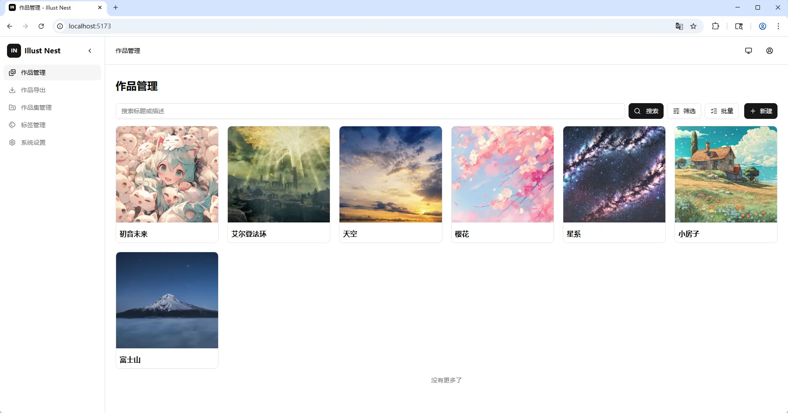

# Illust Nest

超轻量级、自托管的单用户插画和照片图库管理系统，适合部署在树莓派、NAS或云主机上。



## 核心特性

- 登录鉴权：单管理员用户（基于JWT）
- 作品管理：图片上传（单作品支持多张图）、编辑作品信息、类似Pixiv的图片预览、维护标签与评分、重复图片检测、数据统计、原图下载、EXIF查看（支持JPG/TIFF）
- 批量操作：支持批量删除、批量设为公开或私密
- 作品检索：支持按关键字、标签、评分筛选，按时间或评分排序
- 图片格式支持：PNG / JPG / GIF / WebP / BMP / TIFF
- 扩展图片格式支持（通过ImageMagick）：PSD / AI（依赖`ghostscript`） / HEIC及HEIF（依赖`libheif`） / AVIF（依赖`libavif`）
- 作品集管理：将作品整合为作品集维度管理
- 标签管理：支持标签管理和为作品附加标签
- AI元数据编辑：类似Civitai的图片模型、提示词、Lora等信息录入和查看
- 多存储类型支持：支持本地磁盘、S3、WebDAV
- 自动备份：支持主备双存储后端，备份存储后端支持镜像`mirror`和只写`write_only`模式
- 公开访问：
  - 公开作品列表与详情接口
  - 公开图片直链（用于外部页面挂载）
- 作品导出：
  - 打包下载全部图片（ZIP）和Excel索引文件
- 响应式前端：支持 PC / iPad / Mobile
- 支持浅色 / 暗色或跟随系统主题切换

## 技术栈

- Backend: Gin, GORM, SQLite
- Frontend: React, Vite, Tailwind CSS, shadcn/ui

## 快速开始（开发）

### 1) 启动前端

```bash
cd frontend && npm install && npm run dev
```

默认前端地址为`http://localhost:5173`（通过Vite的devServer反向代理`/api`到后端）。

### 2) 启动服务端

```bash
go build -o ./bin/main ./cmd/server/ && ./bin/main
```

默认服务端地址为`http://localhost:8080`。

## 构建与部署

### 1) 构建前端

```bash
cd frontend && npm install && npm run build
```

产物位于`frontend/dist`文件夹中。

### 2) 启动服务端

```bash
GIN_MODE=release go build -o ./bin/main ./cmd/server/ && ./bin/main
```

部署模式下，服务端会直接提供前端静态资源，并自动处理SPA路由回退，访问`8080`即可打开页面。

## 配置说明

配置文件根据环境变量设置加载，`GIN_MODE=release`时默认加载`config/config.prod.yaml`，否则默认加载`config/config.dev.yaml`。此外也可通过环境变量`CONFIG_FILE`指定自定义配置文件路径。

### 配置项示例

```yaml
server:
  port: 8080 # 启动端口
  mode: debug # 设置GIN的运行模式，一般使用release或debug

database:
  driver: sqlite # 固定值，目前仅支持sqlite数据库
  path: ./data/illust-nest.db # 创建数据库文件的路径

storage:
  main: mylocal # 主存储后端
  backup: minio # 备份存储后端（可选）
  backup_mode: mirror # 备份存储模式，mirror镜像写入和删除操作，write_only只写不删除
  providers:
    - name: mylocal # 存储后端名，配置文件中需要唯一
      type: local # 存储后端类型，local本地存储，s3为支持S3协议的对象存储服务器（如MinIO、Amazon S3、Cloudflare R2等），webdav为支持WebDAV协议的存储服务器（例如NextCloud、支持WebDAV协议的网盘等）
      upload_base_dir: ./data/uploads
    - name: minio
      type: s3
      endpoint: "127.0.0.1:9000"
      region: ""
      bucket: "default"
      access_key_id: "root"
      secret_access_key: "abcd1234"
      use_ssl: false
      force_path_style: false
      prefix: ""
    - name: mywebdav
      type: webdav
      webdav_endpoint: "http://localhost:9090/remote.php/dav/files/root"
      webdav_username: "root"
      webdav_password: "abcd1234"
      webdav_prefix: "illust-nest"

web:
  static_dir: ./frontend/dist # 静态资源文件夹的路径，部署时需要指定为Vite编译产物的目录
```

## ImageMagick集成

Illust Nest默认仅支持基础图片格式，对于前面列出的扩展格式支持需要额外安装`ImageMagick`并在系统设置中勾选启用选项集成该组件。`ImageMagick`的v6版本使用`convert`命令，v7版本使用`magick`命令，因此还需要根据具体安装的情况正确选择命令版本。此外`ImageMagick`本身还可能依赖其它库来处理AI、HEIC/HEIF、AVIF，因此这些扩展格式支持是否真的可用需要用户手动确认。执行以下命令可以输出当前安装的`ImageMagick`支持的格式。

```bash
magick -list format
```

注：在类似树莓派的平台上，ImageMagick处理大图片可能有一定性能瓶颈，需要结合实际情况考虑使用。

## 公开（匿名）访问接口

作品可以标记为“公开”，公开的作品可通过公开接口跳过鉴权匿名访问，用于嵌入博客或外部平台。

- 作品列表：`GET /api/public/works`
- 作品详情：`GET /api/public/works/:id`
- 作品原图：`GET /api/public/images/originals/*filepath`
- 作品缩略图：`GET /api/public/images/thumbnails/*filepath`
