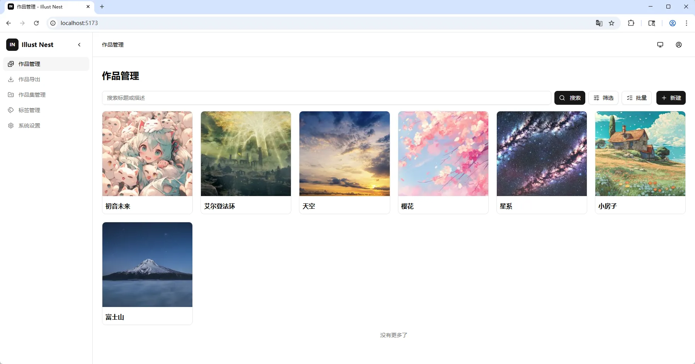

# Illust Nest

A lightweight, self-hosted single-user illustration and photo gallery management system, suitable for deployment on Raspberry Pi, NAS, or cloud servers.

[中文文档](README.zh-CN.md)



## Core Features

- Authentication: Single admin user (JWT-based)
- Work Management: Image upload (multiple images per work), edit work info, Pixiv-like image preview, tags and ratings maintenance, duplicate image detection, statistics, original image download, EXIF viewing (JPG/TIFF supported)
- Public Gallery: Configurable toggle, disabled by default. When enabled, anonymous access to `/public/works` to view public works
- Batch Operations: Batch delete, batch set to public or private
- Work Search: Filter by keyword, tag, rating; sort by time or rating
- Image Format Support: PNG (APNG) / JPG / GIF / WebP / BMP / TIFF
- Extended Image Format Support (via ImageMagick): PSD / AI (requires `ghostscript`) / HEIC & HEIF (requires `libheif`) / AVIF (requires `libavif`)
- Collection Management: Organize works into collections
- Tag Management: Manage tags and attach tags to works
- AI Metadata Editing: Input and view image model, prompts, Lora info (similar to Civitai)
- Multiple Storage Backends: Local disk, S3, WebDAV
- Auto Backup: Primary and backup storage backends supported; backup storage supports `mirror` and `write_only` modes
- Public Access:
  - Public work list and detail APIs
  - Public image direct links (for external embedding), usable as image hosting
- Work Export:
  - Download all images as ZIP with Excel index file
- Responsive Frontend: PC / iPad / Mobile supported
- Light / Dark / System theme switching

## Tech Stack

- Backend: Gin, GORM, SQLite
- Frontend: React, Vite, Tailwind CSS, shadcn/ui

## Quick Start (Development)

In development mode, the frontend uses Vite dev server, and the backend only provides API services.

### 1) Start Frontend

```bash
cd frontend && npm install && npm run dev
```

The default frontend address is `http://localhost:5173` (Vite dev server proxies `/api` to backend).

### 2) Start Server

```bash
go build -tags debug -o ./bin/illust-nest ./cmd/server/ && ./bin/illust-nest
```

The default server address is `http://localhost:8080`.

## Production Build & Deployment

Production build embeds frontend assets into the binary executable.

```bash
# 1. Build frontend
cd frontend && npm install && npm run build

# 2. Build backend
go build -o ./bin/illust-nest ./cmd/server/

# 3. Start service
GIN_MODE=release ./bin/illust-nest
```

In deployment mode, frontend static files are embedded in the binary. The server automatically handles SPA route fallback. Access port `8080` to open the page.

**Note:** The frontend must be built before the backend, as Go embed requires the `frontend/dist` directory to exist during compilation.

## Configuration

Configuration files are loaded based on environment variables. When `GIN_MODE=release`, `config/config.prod.yaml` is loaded by default; otherwise `config/config.dev.yaml`. You can also specify a custom config file path via the `CONFIG_FILE` environment variable.

### Configuration Example

```yaml
server:
  port: 8080 # Server port
  mode: debug # GIN running mode, typically release or debug

database:
  driver: sqlite # Fixed value, currently only sqlite is supported
  path: ./data/illust-nest.db # Database file path

storage:
  main: mylocal # Primary storage backend
  backup: minio # Backup storage backend (optional)
  backup_mode: mirror # Backup storage mode, mirror for write and delete operations, write_only for write-only without delete
  providers:
    - name: mylocal # Storage backend name, must be unique in config
      type: local # Storage backend type: local for local storage, s3 for S3-compatible object storage (e.g., MinIO, Amazon S3, Cloudflare R2), webdav for WebDAV-compatible storage (e.g., NextCloud, WebDAV-enabled cloud storage)
      upload_base_dir: ./data/uploads
    - name: minio
      type: s3
      endpoint: "127.0.0.1:9000"
      region: ""
      bucket: "default"
      access_key_id: "root"
      secret_access_key: "abcd1234"
      use_ssl: false
      force_path_style: false
      prefix: ""
    - name: mywebdav
      type: webdav
      webdav_endpoint: "http://localhost:9090/remote.php/dav/files/root"
      webdav_username: "root"
      webdav_password: "abcd1234"
      webdav_prefix: "illust-nest"
```

## ImageMagick Integration

Illust Nest only supports basic image formats by default. Extended format support requires installing `ImageMagick` and enabling it in system settings. `ImageMagick` v6 uses the `convert` command, while v7 uses `magick`, so select the correct version based on your installation. Additionally, `ImageMagick` may depend on other libraries for AI, HEIC/HEIF, and AVIF support, so users need to verify availability manually. Run the following command to list supported formats:

```bash
magick -list format
```

Note: On platforms like Raspberry Pi, ImageMagick may have performance limitations when processing large images. Consider this based on actual usage.

## Public (Anonymous) Access

When "Enable public gallery" is checked in system settings, the public works page `/public/works` becomes accessible, displaying works marked as "public". Public works can also be accessed anonymously via the following APIs, useful for embedding in blogs or external platforms.

- Tag List: `GET /api/public/tags`
- Work List: `GET /api/public/works`
- Work Detail: `GET /api/public/works/:id`
- Work Image EXIF: `GET /api/public/works/:id/images/:imageId/exif`
- Work Original Image: `GET /api/public/images/originals/*filepath`
- Work Transcoded Image: `GET /api/public/images/transcoded/*filepath`
- Work Thumbnail: `GET /api/public/images/thumbnails/*filepath`
